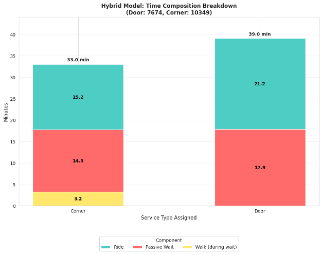
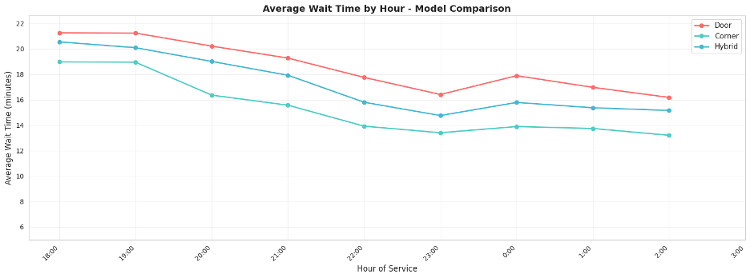

# CU Night Shuttle Hybrid Simulation

**Contributors:** Chung-Yeh Yang, Lucas Zheng, Muya Guoji, Sabrina Wang, Sophia Tu

A data-driven simulation project evaluating operational policies for the Columbia University Night Shuttle service. This project compares the traditional Door-to-Door model with a Corner-to-Corner model and a proposed **Hybrid Policy** to optimize for both efficiency and student safety/convenience.

## Project Overview

The Columbia Night Shuttle plays a crucial role in safe nighttime transportation. However, the legacy Door-to-Door model suffers from inefficiencies due to navigation on high-friction side streets. This study utilizes real demand data from October 2025 to simulate and quantify the trade-offs of different routing strategies.

### The Hybrid Policy
The proposed Hybrid model segments users based on their location relative to arterial avenues:
- **Corner Users (~57%)**: Users near avenues (arterial roads) are routed to safe, fixed corner pickup/drop-off points (avg. walk 1.8 min).
- **Door Users (~43%)**: Users in less accessible or side-street areas continue to receive Door-to-Door service.

This approach functions as a geometric filter, processing the majority of demand via low-friction routes while preserving equitable access for those who need it.

## Key Results

The simulation demonstrates that the Hybrid Policy offers a balanced improvement over the current system.

| Metric | Door-to-Door (Current) | Corner-to-Corner | Hybrid (Proposed) |
|--------|------------------------|------------------|-------------------|
| **Avg Wait Time** | 19.2 min | 15.9 min | **17.8 min** |
| **Avg Ride Time** | 19.3 min | 15.1 min | **17.8 min** |
| **Avg Walk Time** | 0.0 min | 4.6 min | **1.9 min** |
| **Avg Total Journey** | 38.5 min | 31.0 min | **35.6 min** |

**Key takeaways:**
- **Efficiency**: Hybrid model reduces total journey times by roughly 10% compared to Door-to-Door.
- **Equity**: Preserves safety for students in less accessible areas while significantly clearing system congestion.
- **Peak Performance**: Impact is highest during evening peaks (6-8 PM), mitigating wait times that can approach 30 minutes under the Door-to-Door model.

### Visualizations


*Figure 2: Comparison of wait, ride, and walk times across the three scenarios.*


*Figure 4: Breakdown showing how Corner Users in the Hybrid system benefit from significantly faster trips.*


*Figure 5: Hourly trends showing the Hybrid model's effectiveness during peak demand.*

## Repository Structure

```
├── code/
│   ├── simulation.ipynb         # NB: Core simulation logic and Hybrid algorithm
│   ├── visualization.ipynb      # NB: Generation of plots and figures
│   └── sensitivity analysis.ipynb # NB: Testing grid density and parameters
├── images/                      # Visualization results
├── Report.pdf                   # Full detailed project report
├── Presentation.pdf             # Presentation slides
└── README.md                    # This file
```

## Data Sources
- **Ride Requests**: Real data representing demand of Columbia Night Shuttle in October 2025
- **Supply Plan**: Vehicle availability schedule of Columbia Night Shuttle in October 2025

---
